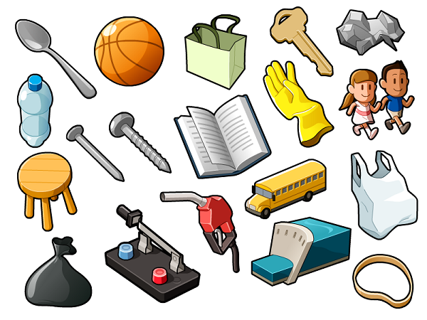

# Nesne (Object) Nedir?

Nesne kelimesinin TDK'deki tanımına bir bakalım:

1. **İsim**: Belli bir ağırlığı ve hacmi, rengi olan her türlü cansız varlık, şey, obje.
2. **İsim, Dil Bilgisi**: Geçişli fiili bütünleyen yalın veya belirtme durumunda bulunan tümleç: Ali bir kitap almış cümlesinde kitap nesnedir.
3. **İsim, Felsefe**: Öznenin dışında kalan her konu, obje: "Her nesne ve olaya alaycı bir gözle bakmak ilkesinden yola çıkar bu görüş." - Salâh Birsel

## Nesnelere Örnekler

Araba, telefon, elma, ördek, kalem gibi günlük hayatta kullandığımız eşyalar.

Bildiğimiz gibi her nesnenin kendine ait nitelikleri ve davranışları vardır. Nesneler birbirlerinden farklıdır ve kendi varoluşlarına göre davranırlar ve kendi kimliklerine sahiptirler.

- **Nitelik**: Nitelik kavramı, bir nesnenin özellikleridir ve nesnenin mevcut durumunu tanımlar. Örneğin, bir ördeğin rengi ve ağırlığı o ördeğin nitelikleridir. Bir ördeğimizin rengi siyah, diğer ördeğimizin rengi beyazdır. Bu durumda her iki nesne (ördek) nitelikleri sebebiyle birbirlerinden bağımsızdırlar.

- **Davranış**: Bir nesnenin kendine özel yaptığı eylemlerdir. Örneğin, bir ördek uçabiliyorken diğer bir ördek fiziksel durumu gereği uçamayabilir.

Nesneler hakkında bilmemiz gereken bir diğer husus ise, nesneler bir isimdir. Nesnelerin kendilerine ait nitelik ve davranışları vardır.

## Sınıf (Class) Nedir?

NYP, sınıflar ve nesneler üzerine kurulmuştur. "Sınıflar", bir problemi soyutlamak ve genelleştirmek için kullanılan yapılardır veya kılavuzlardır. Sınıflar, bir nesneye ait tüm özellikleri temsil eder. Bu özellikler, nesnenin ne tür nitelikleri ve davranışları olacağını belirler.

Örneğin, "Araba" bir sınıftır. Arabalara ait nitelikler renk, hız, vites sayısı, yakıt türü vb. bir sürü nitelik olabilir. Park sensörü, oto pilot, hız sabitleme gibi arabaların kendilerine özel davranışları da olabilir. Bir araba üretilirken, bir yapım kılavuzuna ihtiyaç vardır. Programlamada bu kılavuzlara "Sınıf (Class)" denir.

### Örnek: Banka Sınıf Tasarımı

### Örnek: Banka Nesne İlişkileri

