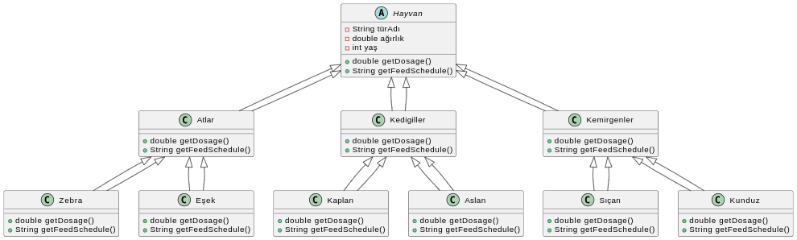

# Hayvanat Bahcesi Yönetimi

Bir hayvanat bahçesindeki hayvanlar hakkındaki bilgileri takip etmek için bir sistem tasarlıyorsunuz.

## Hayvanlar:

- 1 - Atlar (atlar, zebralar, eşekler vb.),

- 2 - Kedigiller (kaplanlar, aslanlar vb.),

- 3 - Kemirgenler (sıçanlar, kunduzlar vb.) gibi gruplardaki türlerle karakterize edilir.

## Diğer Özellikler

- Hayvanlar hakkında depolanan bilgilerin çoğu tüm gruplamalar için aynıdır. (tür adı, ağırlığı, yaşı vb.)

- Sistem ayrıca her hayvan için belirli ilaçların dozajını alabilmeli => getDosage ()

- Sistem Yem verme zamanlarını hesaplayabilmelidir => getFeedSchedule ()

Sistemin bu işlevleri yerine getirme mantığı, her gruplama için farklı olacaktır. Örneğin, atlar için yem verme algoritması farklı olup, kaplanlar için farklı olacaktır.

Polimorfizm modelini kullanarak, yukarıda açıklanan durumu ele almak için bir sınıf diyagramı tasarlayın.

